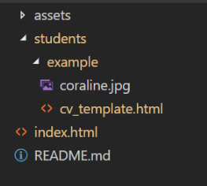

# reprograma-CV
Código criado para a página de currículos da {reprograma}

## Para adicionar seu currículo:
- Crie uma pasta com seu *nome_sobrenome* (como a pasta exemplo) dentro da pasta **students**.
- Copie e cole o **cv_template.html** (que está dentro da pasta exemplo) e remeie com seu *nome_sobrenome*.

### No index.html:
- Em section class="students", substitua com seu nome o **id="student-name"** e o texto da div class="name".
- Complete o link para a págino do seu currículo em **href="./students/"**

